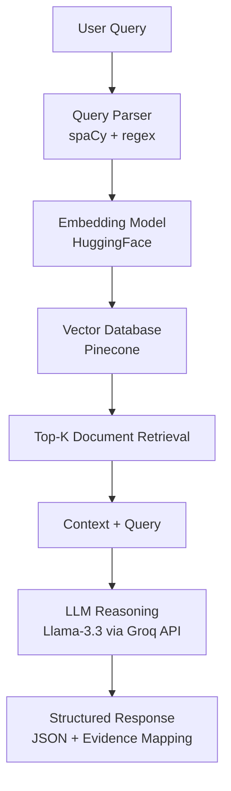
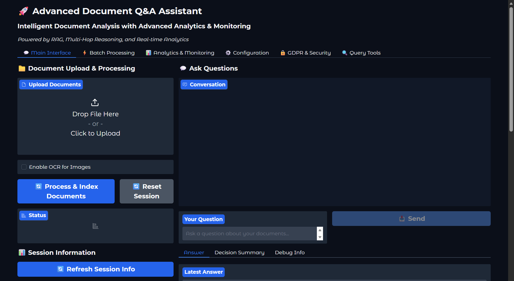
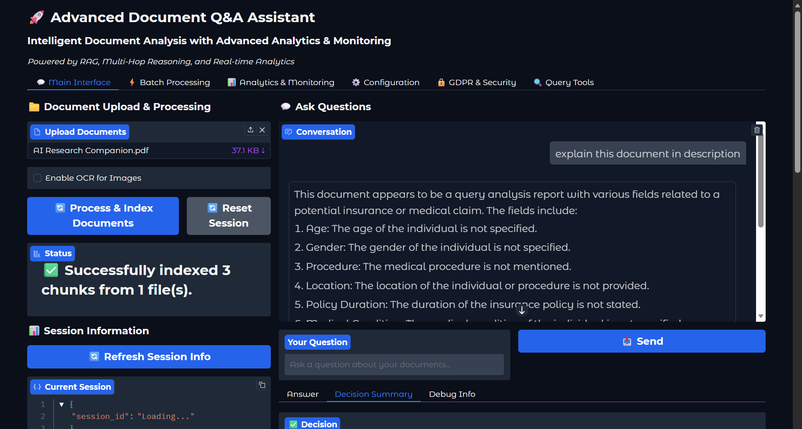
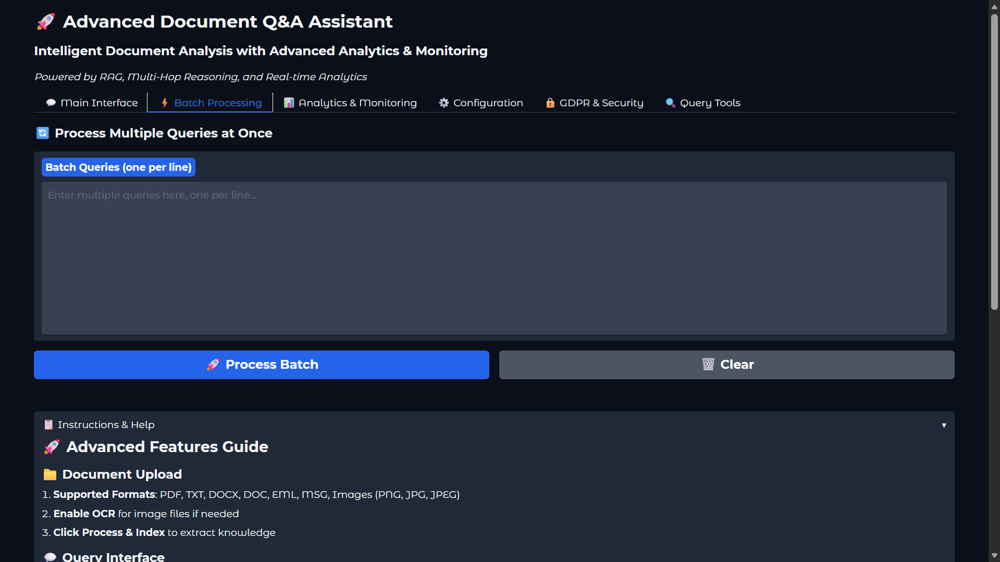
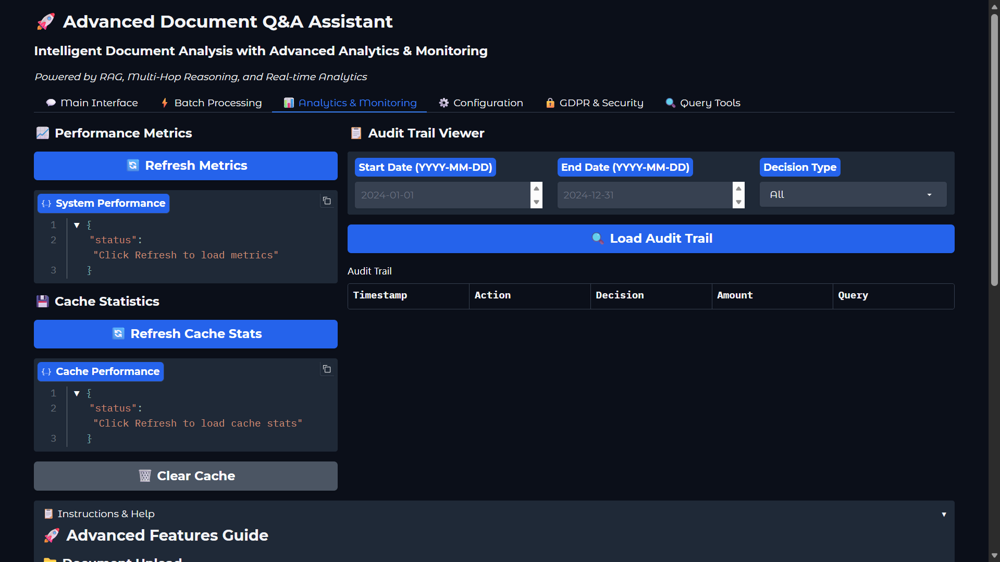
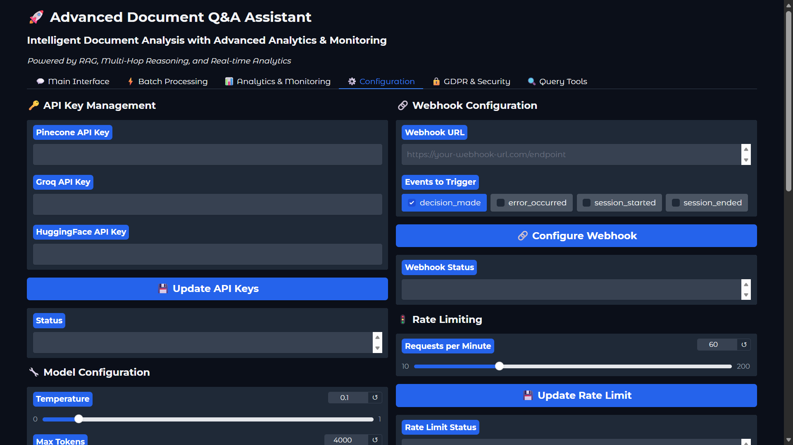
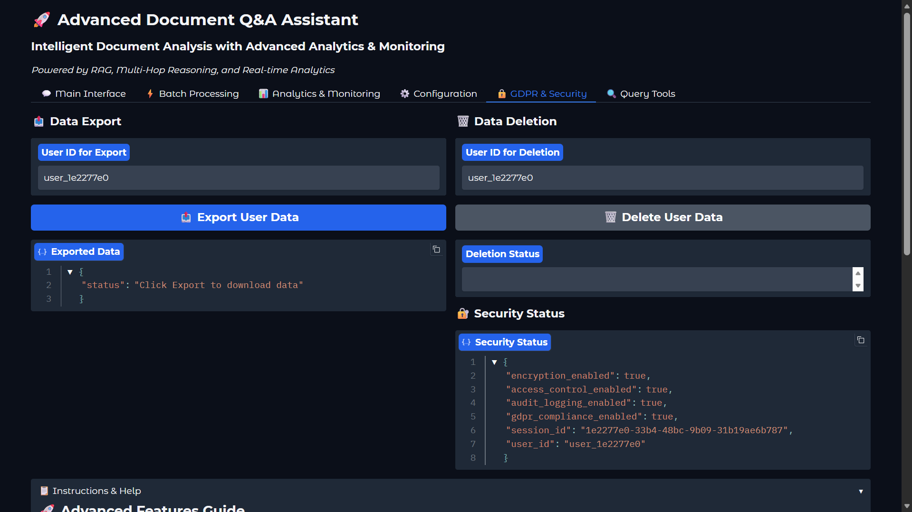
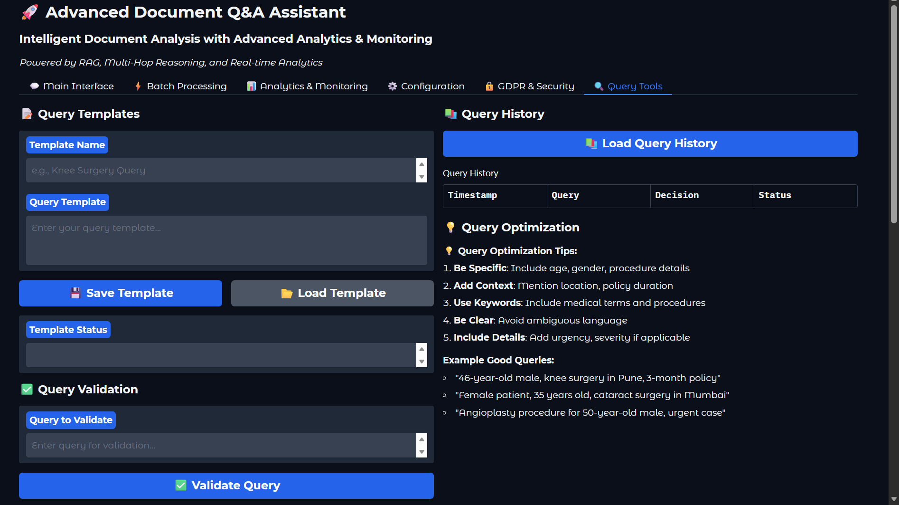

# rag-doc-analyzer

AI-powered Document Q&A assistant for policy, contract, email, and image documents using RAG, vector search, and LLM reasoning.

## Features

- Multi-format document ingestion: PDF, DOCX/DOC, EML/MSG, TXT, PNG/JPG/JPEG
- OCR support for scanned images
- Natural language query parsing with entity extraction
- Semantic retrieval using embeddings + Pinecone vector database
- Multi-hop reasoning and evidence-backed decisions
- Structured JSON response with clause/evidence mapping
- Gradio UI + Flask API support

## Tech Stack

- LLM: Llama-3.3-70B (Groq API)
- Vector Database: Pinecone
- Embeddings: HuggingFace
- Frameworks: LangChain
- NLP Parsing: spaCy + regex
- UI: Gradio
- Backend: Python (Flask APIs)

## Architecture (Diagram)



Architecture flow:

User Query  
↓  
Query Parser (spaCy + regex)  
↓  
Embedding Model (HuggingFace)  
↓  
Vector Database (Pinecone)  
↓  
Top-K Document Retrieval  
↓  
Context + Query  
↓  
LLM Reasoning (Llama-3.3 via Groq API)  
↓  
Structured Response (JSON + Evidence Mapping)

## Demo (Screenshots)









## Repository Structure

```text
rag-doc-analyzer/
├── app.py
├── README.md
├── requirements.txt
├── assets/
│   └── images/
├── docs/
├── src/
│   ├── api/
│   ├── core/
│   ├── interfaces/
│   └── utils/
├── templates/
└── tests/
```

## Installation

1. Clone the repository:
```bash
git clone https://github.com/sumit1kr/rag-document-intelligence
cd rag-doc-analyzer
```

2. Install dependencies:
```bash
pip install -r requirements.txt
```

3. Create a `.env` file in project root:
```env
PINECONE_API_KEY=your_pinecone_key
GROQ_API_KEY=your_groq_key
HUGGINGFACE_API_KEY=your_huggingface_key
```

4. Run the app:
```bash
python app.py
```

## Usage

1. Upload one or more documents.
2. Enable OCR if input includes scanned images.
3. Process and index documents.
4. Ask natural language queries.
5. Review answer, decision details, and evidence mapping.

## Example Response

```json
{
  "decision": {
    "status": "Approved",
    "amount": "50000",
    "confidence": 0.85
  },
  "justification": "Knee surgery is covered for eligible age and policy conditions.",
  "evidence": {
    "supporting_clauses": 2,
    "opposing_clauses": 0
  }
}
```

## Performance

- Fast Top-K semantic retrieval via Pinecone
- Improved answer quality from query parsing + multi-hop reasoning
- Clause-level evidence mapping for auditable decisions
- Designed to handle large, unstructured policy documents

## License

This project is licensed under the MIT License.
